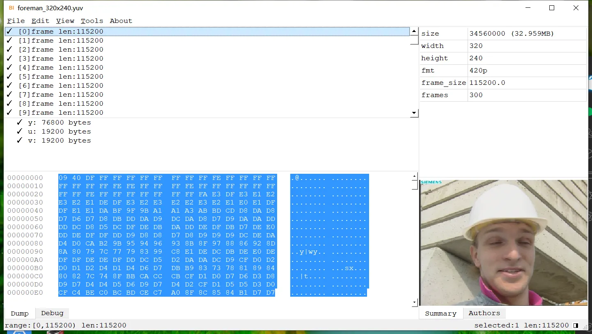

# BinInspector 文件格式查看器
# 最新下载地址:
  Mac: [BinInspector_v0.0.1.dmg](https://github.com/tongpengfei/bin_inspector/releases/download/v0.0.1/BinInspector_v0.0.1.dmg)  
  Windows: coming soon...  
  
  
### 主要功能
  * 以列表，树的形式，二进制数据的形式，查看文件格式
  * 把一个大的pcap文件按链接切隔为各个小的pcap文件
  * 查找二进制，字符串，数字
  * 时间戳转为日期，日期转为时间戳 ms2date date2ms
  * 时间戳转为ntp, ms2ntp, ntp2ms
  * 选取一段数据，另存为文件
  * 视频文件可以按帧查看图片
  * 格式解析插件化，每一个格式就是一个lua脚本，根据文件名后缀解析格式
  * 支持二次开发，可以自由扩展格式

### 支持二次开发
  * scripts/codec里是目前支持的所有解析器，可以参考codec_default.lua开发自己的解析器
  * BinInspector会自动加载scripts/codec下的所有解析器，这里仅应放置公共解析器，也就是开源的解析器
  * Mac下的私有解析器可以放在~/.bin_inspector/scripts/codec下面，比如仅自己使用的解析器可以放在这里

### 目前支持的文件格式

| file format | supported | draw picture | comment |
| :-----: | :----: | :----: | :---- |
| aac | ✓ |   |   |
| wav | ✓ |   | extract pcm; seperate L/R pcm  |
| mp3 | ✓ | ✓ |   |
| flv | ✓ |   |   |
| mp4 | ✓ | ✓ | show timeline; show audio/video frames  |
| yuv | ✓ | ✓ | draw y/u/v/yuv picture  |
| h264 | ✓ | ✓ |   |
| h265 | ✓ |   |   |
| rtp | ✓ |   |   |
| rtcp | ✓ |   |   |
| pcap,pcapng | ✓ |  | split pcap by stream, extract h264/payload by stream |

  * bin: 默认格式，未识别的文件名后缀，会以默认格式解析数据
  * aac: 音频文件，解析每帧的数据及格式
    * 文件大小
    * 通道数
    * 采样率
    * 帧数
    * 码率
    * 时长
  * mp3: 基础信息，支持显示mp3封面图片
    * 文件大小
    * 通道数
    * 采样率
    * 码率
    * 帧数
    * 时长
    
  * mp4: 显示以下基础信息
    * 支持显示每帧视频图片
    * 文件大小
    * 总时长
    * 视频track
      * 视频格式
      * 分辨率
      * 视频时长
      * 帧数
      * fps
      * 码率
    * 音频track
     * 采样率
     * 采样大小
     * 音频时长
     * 通道数
     * 帧数
     
  * flv: 基础信息，音视频tag
  
  * h264: SPS,PPS,IDR,SLICE等信息
    * 支持显示视频图片
    * 文件大小
    * 帧数
    * 分辨率
    * yuv格式
    * fps
    
  * h265: 显示SPS,PPS等信息
  
  * yuv: yuv视频格式
    * 显示分辨率
    * 目前仅支持420p
    * 支持显示图片
    * 支持显示y,u,v分量图片
    
  * pcap pcapng: tcpdump抓包文件
    * 支持解析rtp
    * 支持以单向链接为单位，分隔文件，并保存至/tmp/目录，如所有192.168.0.1:666 -> 10.0.0.1:80的数据流保存为一个文件
    * 支持以双向链接为单位，分隔文件，并保存至/tmp/目录，如所有192.168.0.1:666 <-> 10.0.0.1:80的数据流保存为一个文件
    * 支持以链接为单位提取payload，也就是从 tcp|udp的后面开始提取数据
    * 支持从rtp里提取h264，并保存至/tmp文件
    * 支持端口解析配置，不同的端口解析为不同的格式

### 截图

