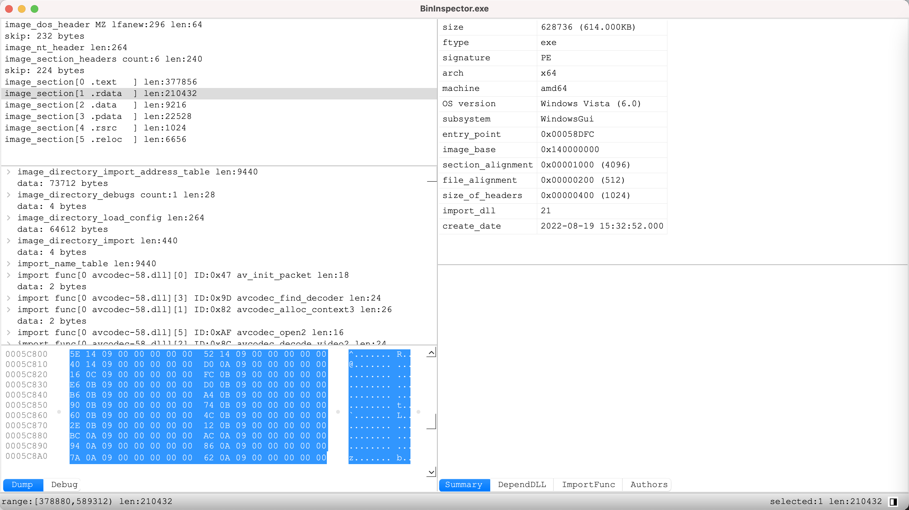
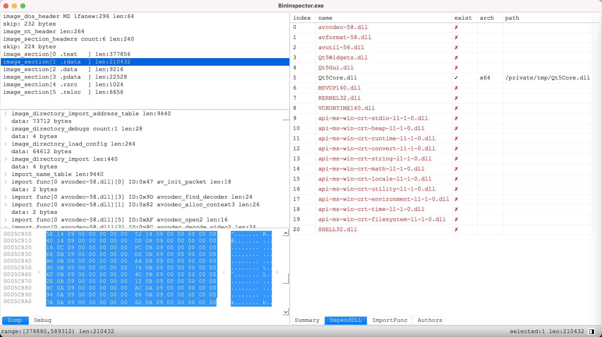
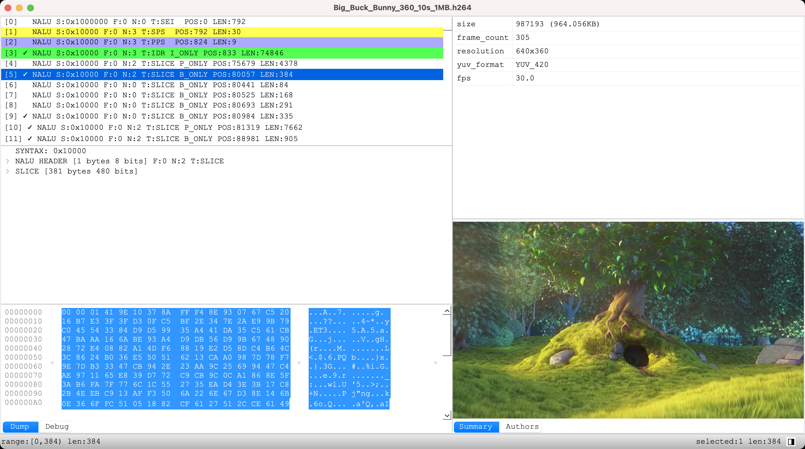
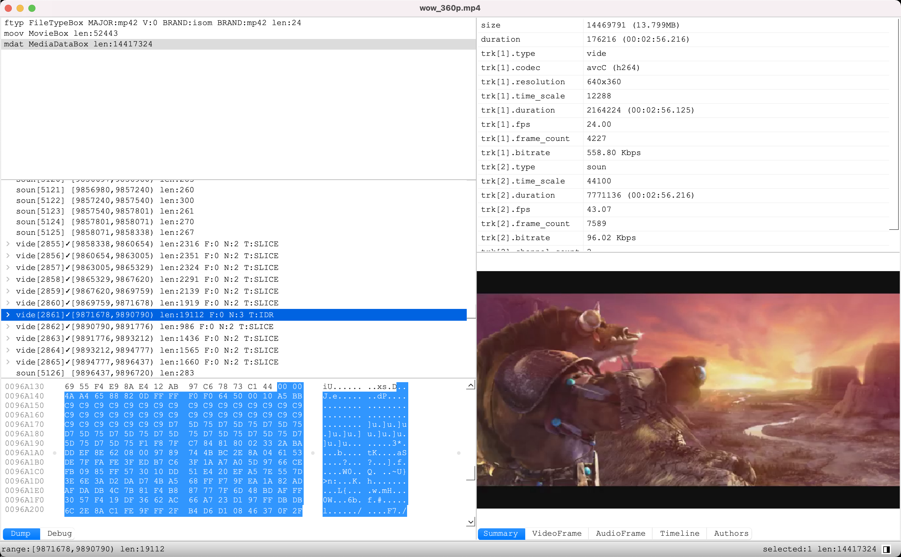

# BinInspector 文件格式查看器
# 最新下载地址:
  Mac: [BinInspector_v0.0.2.dmg](https://github.com/tongpengfei/bin_inspector/releases/download/v0.0.2/BinInspector_v0.0.2.dmg)  
  Windows: [BinInspector_win64_release_v0.0.1.zip](https://github.com/tongpengfei/bin_inspector/releases/download/v0.0.2/BinInspector_win64_release_v0.0.2.zip)
  
  
### 主要功能
  * 查看文件格式
  * 把一个大的pcap文件按链接切隔为各个小的pcap文件
  * 查找二进制，字符串，数字
  * 时间戳转为日期，日期转为时间戳 ms2date date2ms
  * 时间戳转为ntp, ms2ntp, ntp2ms
  * 选取一段数据，另存为文件
  * 视频文件可以按帧查看图片
  * 格式解析插件化，每一个格式就是一个lua脚本，根据文件名后缀解析格式
  * 支持二次开发，可以自由扩展格式

### 支持二次开发
  * scripts/codec里是目前支持的所有解析器，可以参考codec_default.lua开发自己的解析器
  * BinInspector会自动加载scripts/codec下的所有解析器，这里仅应放置公共解析器，也就是开源的解析器
  * Mac下的私有解析器可以放在~/.bin_inspector/scripts/codec下面，比如仅自己使用的解析器可以放在这里

### 目前支持的文件格式

| file format | supported | draw picture | comment | screenshot |
| :-----: | :----: | :----: | :---- | :---- |
| exe,dll | ✓ |   | check depends dll is exists | [mac_exe.png](doc/screenshots/mac_exe.png)  |
| aac | ✓ |   |   | [mac_aac.png](doc/screenshots/mac_aac.png)  |
| wav | ✓ |   | extract pcm; seperate L/R pcm  | [mac_wav.png](doc/screenshots/mac_wav.png) |
| mp3 | ✓ | ✓ |   | [mac_mp4.png](doc/screenshots/mac_mp3.png) |
| ogg | ✓ |   |   | [mac_ogg.png](doc/screenshots/mac_ogg.png) |
| opus | ✓ |   |   | [mac_opus.png](doc/screenshots/mac_opus.png) |
| flv | ✓ |   |   | [mac_flv.png](doc/screenshots/mac_flv.png) |
| mp4,m4a | ✓ | ✓ | show timeline; show audio/video frames  | [mac_mp4.png](doc/screenshots/mac_mp4.png) |
| yuv | ✓ | ✓ | draw y/u/v/yuv picture  | [win_yuv.png](doc/screenshots/win_yuv.png) |
| h264 | ✓ | ✓ |   | [mac_h264.png](doc/screenshots/mac_h264.png) |
| h265 | ✓ |   |   | [mac_h265.png](doc/screenshots/mac_h265.png) |
| rtp | ✓ |   |   | [mac_rtp.png](doc/screenshots/mac_pcap_rtp.png)|
| rtcp | ✓ |   |   | [mac_rtcp.png](doc/screenshots/mac_rtcp.png) |
| pcap,pcapng | ✓ |  | split pcap by stream, extract h264/payload by stream | [mac_rtcp.png](doc/screenshots/mac_pcap.png)  [mac_rtp_extract_h264.png](doc/screenshots/mac_pcap_rtp_extract_h264.png) |

  * bin: 默认格式，未识别的文件名后缀，会以默认格式解析数据
  * pcap pcapng: tcpdump抓包文件
    * 支持解析rtp
    * 支持以单向链接为单位，分隔文件，并保存至/tmp/目录，如所有192.168.0.1:666 -> 10.0.0.1:80的数据流保存为一个文件
    * 支持以双向链接为单位，分隔文件，并保存至/tmp/目录，如所有192.168.0.1:666 <-> 10.0.0.1:80的数据流保存为一个文件
    * 支持以链接为单位提取payload，也就是从 tcp|udp的后面开始提取数据
    * 支持从rtp里提取h264，并保存至/tmp文件
    * 支持端口解析配置，不同的端口解析为不同的格式

### 截图

