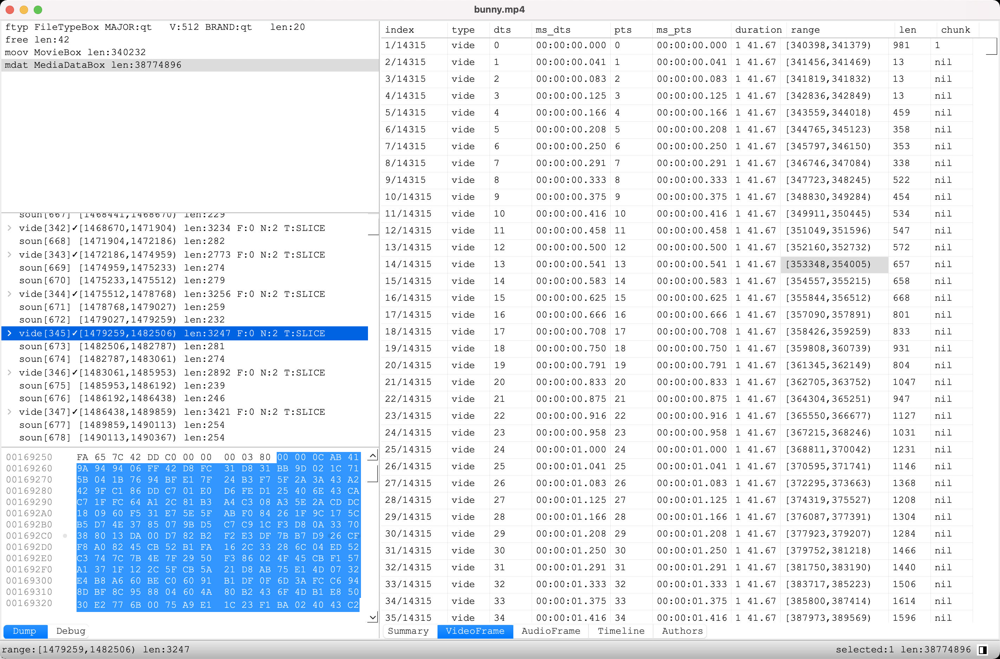
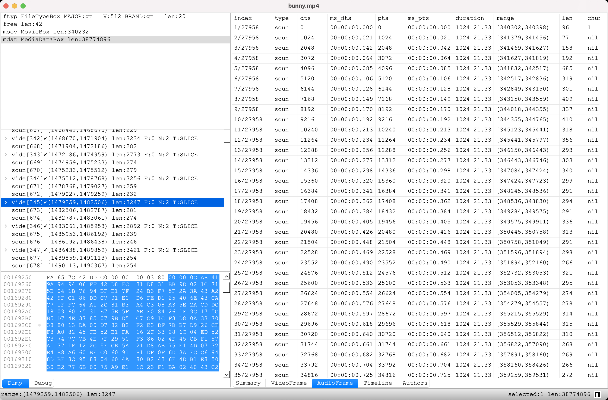
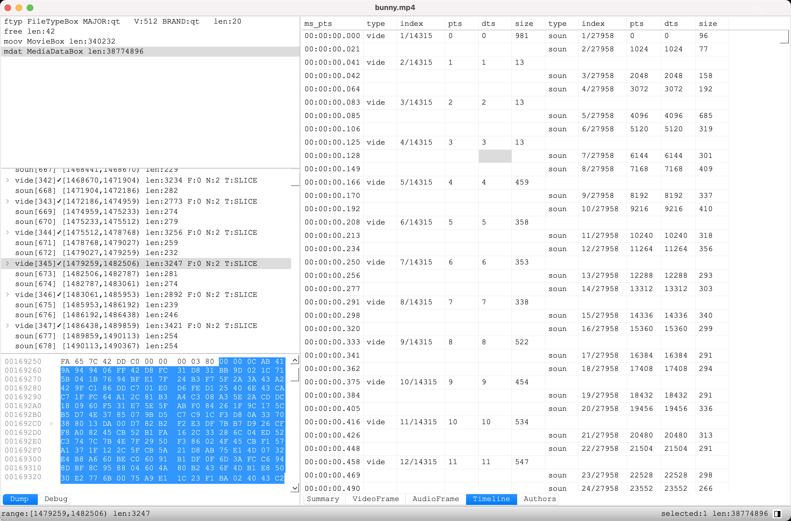

# BinInspector用户手册-mp4解析器

BI支持解析mp4文件 

* 显示视频预览  
  

* 显示视频帧信息VideoFrame  

  每个视频帧的dts,pts,字节偏移位置,帧长度  
  

* 显示音频帧信息AudioFrame  

  每个音频帧的dts,pts,字节偏移位置,帧长度  
  

* 显示时间轴Timeline  

  按时间轴显示音视频帧的位置  
  
