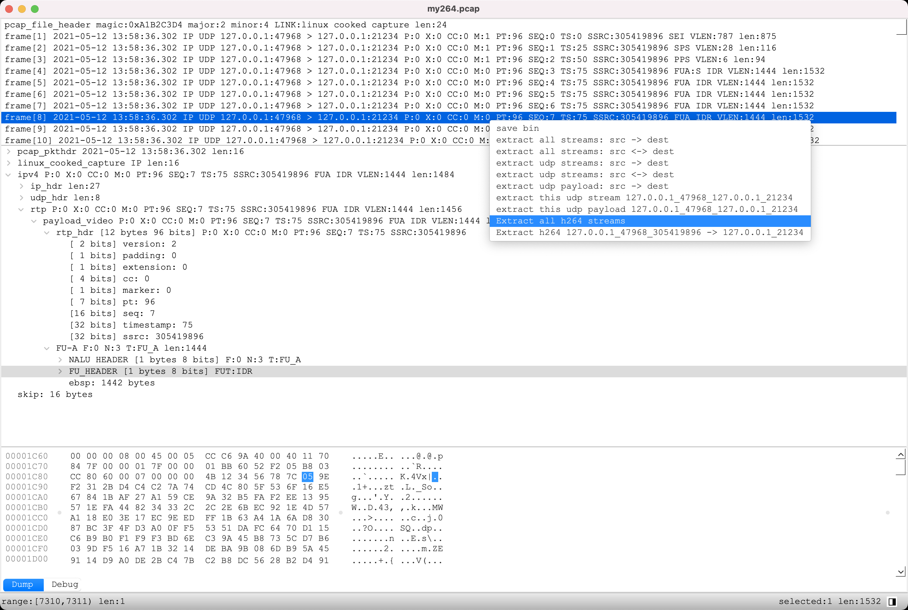

# BinInspector用户手册-pcap,pcapng抓包文件解析器

抓包解析是我平时用的最多的工具之一，一般我会用这个工具
* 把一个大的抓包文件按链路分隔成多个文件，然后单个分析，  
  这样就不用在wireshark里每次都输入不同的条件。  
  也方便根据分隔出来的文件大小判断一路流发送数据量的多少。

* 从抓包中提取出rtp h264数据,然后再用BI分析h264数据，  
  可以直观的看到每帧画面。  

* 解析标准rtp,rtcp数据  

* 解析自研rtp,rtcp数据(这部分没有放出来)  

* 导出某一帧的rtp payload数据,放在程序里重现某种现象或bug。  

* 还有很多自定义用法，就看自己怎么改造解析器啦，比如转换  
  rtp timestamp,ntp转ms,ms转ntp,统计rtp一些数据之类的可以提  
  高工作效率的用法。  
 

  在视频rtp帧上右键，会弹出快捷菜单,各项功能如下:

* save bin: 保存该帧的二进制数据  
* extract all streams: src -> dest 按源地址_目标地址数据单向流向分隔文件，包括tcp,udp  
* extract all streams: src <-> dest 按源地址_目标地址数据双向流向分隔文件,包括tcp,udp  
* extract udp streams: src -> dest 只提取udp单向流数据
* extract udp streams: src <-> dest 提取udp双向流数据
* extract this udp stream srcip_srcport_dstip_dstport: 只提取该路流
* extract this udp payload srcip_srcport_dstip_dstport: 只提取该路流的payload
* extract all h264 streams: 提取所有流的h264数据  

