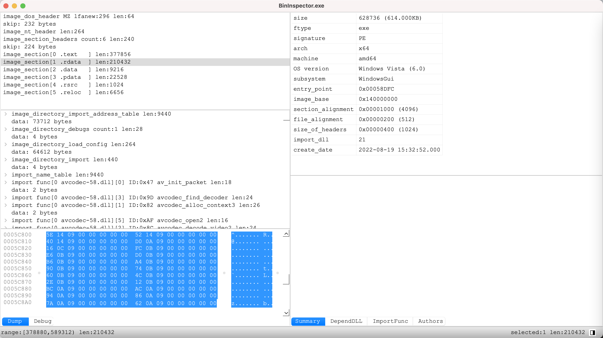
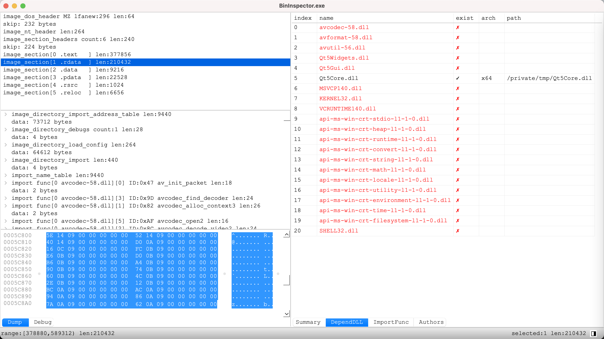

# BinInspector用户手册-PE解析器

PE文件也就是我们常用的exe, dll文件。  

BI可以把整个PE的文件结构清晰的显示出来，方便学习。

当我们运行一个exe程序时，通常会依赖一些dll库，使用BinInspector可以很方便的查看缺少哪个dll。

或者提示\
应用程序无法正常启动0xc000007b

这个问题一般是dll不匹配，比如exe是x64的，dll是x86的，就会提示该错误\
这时就可以用BI查看该exe，确定具体是哪个dll不匹配。

下图红色就表示没找到相应的dll  
  